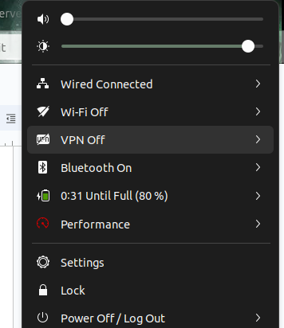

# Installing and Configuring OpenVPN on an AWS Instance

## Introduction
OpenVPN is a robust and highly flexible VPN solution. This guide will walk you through the steps to install and configure OpenVPN on an AWS instance.

## Table of Contents
- [Prerequisites](#prerequisites)
- [Launch an AWS Instance](#launch-an-aws-instance)
- [Connect to Your Instance](#connect-to-your-instance)
- [Install OpenVPN](#install-openvpn)
- [Configure OpenVPN](#configure-openvpn)
- [Start OpenVPN Service and Set Up Client Configurations](#start-openvpn-service-and-set-up-client-configurations)

## Prerequisites
- AWS account with necessary permissions to create and manage instances.
- Basic knowledge of AWS EC2 and SSH.


## Launch an AWS Instance

1. **Log in to your AWS Management Console.**
2. **Navigate to the EC2 Dashboard.**
3. **Click on 'Launch Instance'.**
4. **Choose an Amazon Machine Image (AMI):**
   - Select an Ubuntu Server (e.g., Ubuntu Server 20.04 LTS).
5. **Choose an Instance Type:**
   - A t2.micro instance type is sufficient for basic setups.
6. **Configure Instance Details:**
   - Ensure the instance is in the desired VPC and subnet.
   - Configure Auto-assign Public IP to 'Enable' if needed.
7. **Add Storage:**
   - The default settings are usually sufficient.
8. **Add Tags:**
   - Optionally add tags for easier identification.
9. **Configure Security Group:**
   - Add rules to allow SSH (port 22) and OpenVPN (port 1194).
10. **Review and Launch:**
    - Review your settings and click 'Launch'.
    - Select an existing key pair or create a new one to access your instance.

## Connect to Your Instance

1. **Download the Key Pair (if you created a new one).**
2. **Set permissions for the key file:**
```bash
chmod 400 your-key-pair.pem
```
3.Connect to your instance via SSH:
```bash
ssh -i "your-key-pair.pem" ubuntu@your-instance-public-dns
```

## Install OpenVPN

1. **Update your package list:**
```bash
sudo apt-get update
sudo apt-get upgrade
```

2. **Install OpenVPN**
```bash
bash <(curl -fsS https://as-repository.openvpn.net/as/install.sh)
```

3. **After installing the openvpn-as package, take note of the Admin UI and Client UI addresses as well as the randomly generated password for your administrative user openvpn.**
    - These details will display on screen similar to this example:


4. **Using the information from the previous step, connect to the Access Server and sign in with the openvpn user and password.**
5. **The URL for the Admin Web UI is:**
   - https://[Public_IP_of_AWS_instance]:943/admin/
   - Replace [Public_IP_of_AWS_instance] with your server's public IP address or DNS hostname. It will look something like:


## Configure OpenVPN

After logging in with your credentials, make a few changes:

1. **Click on 'Configuration'** and then select **'Network Settings'**.


2. **Change the Hostname or IP Address** to the public IP address of the AWS instance on which the OpenVPN server is installed.

3. **Save the changes** and update the server by clicking on **'Update Server'**.

## Create a User for OpenVPN

1. **Click on 'User Management'** and then select **'User Permissions'**.


2. **Create a user** (e.g., `private_instance_access`, but you can choose any name).

3. **Click on 'More Settings'.**

4. **Set a Local Password.**

5. **Select 'Allow Access From'** and specify the allowed access settings.

6. **Save Settings** and click on **'Update Server'** after making the changes.

## Start OpenVPN Service and Set Up Client Configurations

Now let's download the `.ovpn` file and configure it.

1. **The URL for the USER Web UI is:**
   ```plaintext
   https://[Public_IP_of_AWS_instance]:943/admin/
   ```
  
2. **Replace [Public_IP_of_AWS_instance] with your server's public IP address or DNS hostname. It will look something like this.**
3. **After logging in, you will see an interface that will automatically suggest how to set up VPN for your respective devices.**

4. **It will automatically suggest you how to setup VPN for respective devices.**

### Here I am Linux
1. **Download the `.ovpn` file** by clicking on **'Connection Profile'** inside the user interface (Web UI).

2. **Click on the upper right side of the screen** and open **'Networks'**.
3. **Click on the VPN plus sign** and **import the file** you have downloaded (extension must be `.ovpn`).


4.**Click on the VPN** and select it.

5. **After configuring it**, you will see something like this on the right side
 
